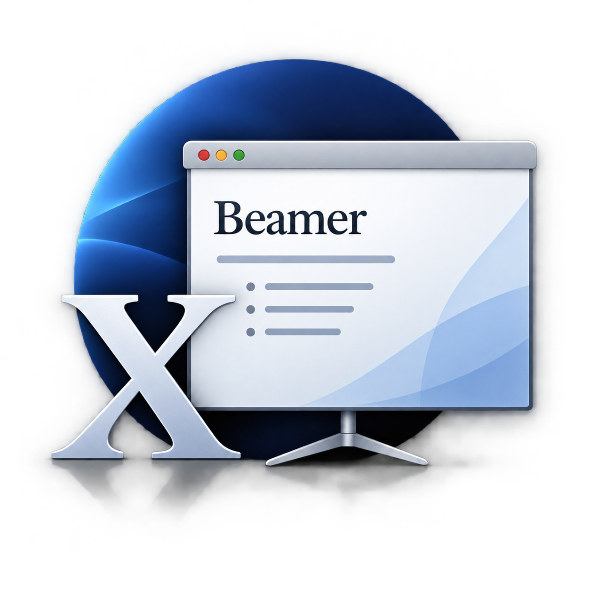

# Beamer Theme OSX
*A MacOS X 10.5 (Leopard) look for your slides.*

Copyright (C) 2026 Didier Verna

Author: Didier Verna <didier@didierverna.net>

This file is part of Beamer Theme OSX.

Beamer Theme OSX may be distributed and/or modified under the conditions of
the LaTeX Project Public License, either version 1.3c of this license or (at
your option) any later version. The latest version of this license is in
http://www.latex-project.org/lppl.txt and version 1.3c or later is part of all
distributions of LaTeX version 2008 or later.

Beamer Theme OSX consists of the files listed in the file `MANIFEST.md`.

### Resources
 - [Project homepage](didierverna.net/projects/doceng/beamer-theme-osx)
 - [Project repository](github.com/didierverna/beamer-theme-osx)

## Installation
From a repository clone or source directory, type `l3build install` to install
the theme locally. Type `l3build doc` to compile the documentation. After the
theme is installed, you may switch to the `demo/` directory and compile the
example there. This will allow you to see what the theme looks like. The
demonstration source file's premable contains all the customization commands
for quick reference.

From a CTAN archive, run the file `beamerthemeosx.ins` through LaTeX. Then,
copy all style and image files to your TDS-compliant installation, typically:
`[TEXMF]/tex/latex/beamer-theme-osx/`. The documentation is already compiled.
You may also process the demonstration file `demo.tex`. This will allow you to
see what the theme looks like. The demonstration source file's preamble
contains all the customization commands for quick reference.

From a TDS-compliant archive (`.tds.zip`), unpack directly into your `[TEXMF]`
directory. The precompiled documentation and demo files mentioned above will
be located in `[TEXMF]/doc/latex/beamer-theme-osx/`.
